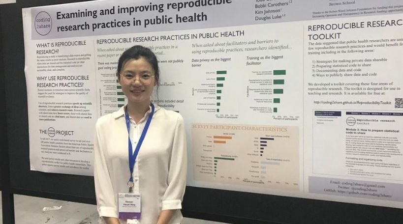

```{r setup, include=FALSE}
options(htmltools.dir.version = FALSE)
```

# What is R-Ladies?

- R-Ladies is a world-wide organization with the mission of promoting **gender diversity in the R community**  

- Started in San Francisco in 2012  

- Currently has Meetup groups in **138 cities in 44 countries for a total of 39,676** members globally  
<center>


---

# R-Ladies St. Louis 

* Started in September 2017 by Jenine Harris and Chelsea West 


---
# R-Ladies St. Louis Past Meetups

- Meet & greet with Dr. Bobbi Carothers, Dr. Angelique Zeringue, Alexandra Morshed, Mary Painter, Rebecca Willison, & Lorinette Worth 

- RCPP Introduction with Erin Rossiter 

- Introduction to R with Shelly Cooper 

- Intro Part Deux with Mary Painter & Christina Garcia 

- Reproducible research with R with Dr. Bobbi Carothers 

- Plotting something great: Making graphs in R with Shelly Cooper 

- Get going with GitHub with Laura Brugger 


    

---


# R-Ladies St. Louis current and past sponsors

<center>
&nbsp;&nbsp;&nbsp;
&nbsp;&nbsp;&nbsp; &nbsp;&nbsp;&nbsp;   &nbsp;&nbsp;&nbsp;

  &nbsp;&nbsp;&nbsp;&nbsp;   &nbsp;&nbsp;&nbsp;&nbsp;     &nbsp;&nbsp;&nbsp;&nbsp;     &nbsp;&nbsp;&nbsp;&nbsp;     


---
# Remaining meetups for 2018-2019 

- (April 18) <a href="https://www.meetup.com/R-Ladies-St-Louis/events/254505655/">Mapping St. Louis health and social data with R</a> with Dr. Chris Prener

<center><br>


---

# Today 

- Xiaoyan Wang is here to Introduce you to R 
<center><br>
 

- Food and space generously provided by net**effects** (host: Stephanie Grimshaw) and **Microsoft** (hosts: Amy Hulse & Todd Kitta)<br>
&nbsp;&nbsp;&nbsp;&nbsp;

---

# Want to learn more or get involved?

- Visit **rladies.org** to learn about the mission and global work of R-Ladies 

- Connect with R-Ladies St. Louis 
    + Email us at <a href = "mailto:rladiesstl@gmail.com">rladiesstl@gmail.com</a> 
    + Follow us on Twitter <a href="https://twitter.com/RLadiesSTL">@rladiesstl</a>
    + Connect with us on <a href="https://www.meetup.com/R-Ladies-St-Louis/">Meetup</a>
    


---

# R-Ladies STL Meetup #8: Introduction to R with Xiaoyan Wang

- Wifi 
    + MSGUEST 
    + event attendee code: msevent933xh 

- Things to do before we start:
    +	Install R 
    +	Install RStudio
    +	Download the materials at https://github.com/rladiesstl/meetup.mar6.2019 


